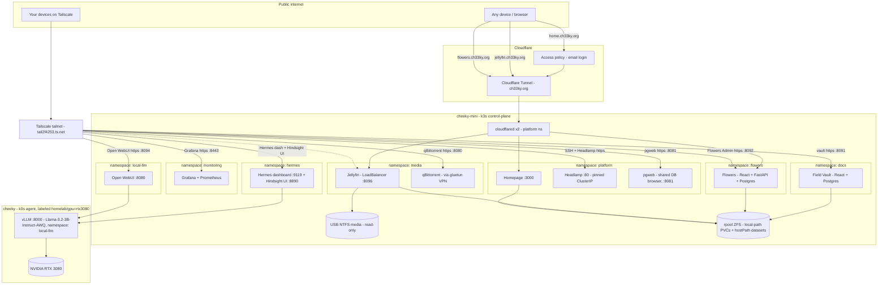

# homelab — `cheeky-mini` + `cheeky`

Two-node **k3s** homelab running a Jellyfin media server, a personal
**document + field vault** ([doc-catalog](doc-catalog/README.md)), a
**digital flower gift** app ([flower-delivery](flower-delivery/)), download
automation ([arr/](arr/kubernetes/README.md)), workflow automation
([n8n](n8n/README.md)), local LLM inference ([local-llm](local-llm/README.md)),
a metrics stack (Grafana + Prometheus), and a small platform stack
(dashboard, service hub, secure remote access). `cheeky-mini` is the
control-plane box; `cheeky` joined later as a GPU agent node. Adding further
agent nodes is a one-liner (see **Add an agent node** below), and workloads
that must stay on a given box are pinned with node labels/affinity.

> **Resilience honesty:** **one control-plane node** = **pod self-healing
> only**. k3s restarts crashed pods on either node; it does **not** survive
> `cheeky-mini` (the only control-plane/etcd node) dying — losing `cheeky`
> just takes the GPU workloads down. True HA needs 3+ control-plane nodes
> for etcd quorum. This is a foundation for that, not that.

> **Using this as a template:** the services below are *this* homelab's
> picks — swap in whatever you actually run. What's meant to transfer is the
> pattern: node/GPU-aware placement (labels + affinity, not hope), a
> three-lane access model (public tunnel / tailnet-only / cluster-internal
> so nothing sensitive is one misconfigured Ingress from the internet), and
> picking the cheapest storage class that meets each workload's durability
> need (see [docs/ARCHITECTURE.md](docs/ARCHITECTURE.md#2-node--hardware-placement)).
> The [`homelab` CLI](bin/README.md) and repo layout below are also a
> reasonable starting skeleton for a second cluster.

---

## Hardware / base OS

| | |
|---|---|
| Host | `cheeky-mini` (control-plane), Intel i7-12650H (10c/16t), 32 GB RAM |
| GPU | Intel Alder Lake iGPU (`/dev/dri/renderD128`) — used for HW transcode |
| Boot/data disk | 1 TB NVMe, **ZFS-on-root** (ZSys); `rpool` ~816 GB free |
| Media disk | 1 TB USB Seagate, **NTFS** (ntfs-3g), mounted `/media/cheeky/seagate_hdd`, read-only to pods |
| OS | Ubuntu 24.04 desktop (also a daily debugging machine — changes kept reversible) |
| Kubernetes | k3s v1.36, `--snapshotter=native` (required on ZFS), ServiceLB/klipper + Traefik (bundled ingress) both kept |
| Host | `cheeky` (agent), Intel i5-12600K (10c/16t), 31 GB RAM |
| GPU | NVIDIA RTX 3080 — labeled `homelab/gpu=rtx3080`, targeted by the vLLM Deployment in `local-llm/kubernetes/`; needs host-level NVIDIA driver + `nvidia-container-toolkit` before it'll actually schedule |
| Disk | 478 GB NVMe (root) |
| OS | Pop!_OS 22.04 desktop (dual-boot with Windows) |

---

## Architecture

At a glance — see **[docs/ARCHITECTURE.md](docs/ARCHITECTURE.md)** for the
full picture: every tailnet-only service (not just the ones below), node/GPU
placement, the three storage patterns in play, and the arr-stack data-flow
diagram.



### Access model — public vs private
- **Public (Cloudflare Tunnel):** outbound-only connector, no inbound ports.
  Routing is configured in the Cloudflare Zero Trust dashboard.
  - `home.ch33ky.org` → Homepage, behind **Cloudflare Access** (email login).
  - `jellyfin.ch33ky.org` → Jellyfin, on **Jellyfin's own auth** (no Access, so
    native mobile/TV apps work).
  - `flowers.ch33ky.org` → Flowers, no auth (public by design — anyone with
    the link composes/opens a gift; nothing sensitive is stored).
- **Private (Tailscale host install):** the node joins the tailnet
  (`tail2f4253.ts.net`). Gives Tailscale SSH into the box and tailnet-only
  access to admin services, each on a pinned ClusterIP + `tailscale serve`
  port so the binding survives redeploys — **Headlamp**, **Field Vault**,
  **Flowers Admin**, **Grafana**, **pgweb**, **Traefik dashboard**,
  **Open WebUI**, **Zot registry**, **Hermes dashboard**, **Hindsight UI**,
  **Prowlarr/Radarr/Sonarr/qBittorrent**, **ContainerSSH** (raw TCP) +
  **Wetty** (browser terminal), **n8n**. Full port list: `homelab urls`. None of
  these are ever public — the vLLM inference endpoint itself isn't even
  tailnet-exposed, it's cluster-internal only (Open WebUI and Hermes are the
  only things that talk to it directly).
- **Traefik** is k3s-bundled and left enabled, but isn't used as an ingress
  for any app today — only its dashboard is wired up (tailnet-only, same as
  everything else above). See
  [docs/ARCHITECTURE.md](docs/ARCHITECTURE.md#1-access-layer) for why.

### Secrets
No secrets in the repo. The Cloudflare connector token lives in a k8s Secret
(`cloudflared-token`) created out-of-band. `.gitignore` blocks token/secret
files; `*.example.yaml` templates are the only committed config stand-ins.

---

## Components

| Service | Namespace | Exposure | Notes |
|---|---|---|---|
| **Jellyfin** | `media` | `jellyfin.ch33ky.org` (public) + tailnet + LAN `:8096` | linuxserver image, PUID/PGID 1000. iGPU transcode via `/dev/dri` + `supplementalGroups [992,44]` (no privileged). Media hostPath **read-only** with `HostToContainer` propagation (needed for the ntfs-3g FUSE mount). Config on a local-path PVC. Pinned to this node via `nodeAffinity: homelab/media-store=seagate`. |
| **Headlamp** | `platform` | tailnet-only (`tailscale serve`) | Cluster admin UI (successor to the archived k8s Dashboard). ClusterIP pinned `10.43.142.241` so the host-side `tailscale serve` target is stable. Login = `headlamp` ServiceAccount bearer token (cluster-admin, gated at the network layer). |
| **Homepage** | `platform` | `home.ch33ky.org` (behind Access) | Central hub. Config is a ConfigMap seeded into a writable `emptyDir` by an initContainer (the image writes into its config dir on boot). Read-only RBAC for k8s service discovery. `HOMEPAGE_ALLOWED_HOSTS` must list every hostname it's served on. |
| **cloudflared** | `platform` | — (outbound only) | 2 replicas for HA. Token from the `cloudflared-token` Secret; remotely-managed tunnel (routing in the CF dashboard). |
| **pgweb** | `platform` | tailnet-only (`:8081`) | Shared read-only Postgres browser for *both* apps' DBs (doc-catalog + flowers) via pgweb's bookmark picker (`--bookmarks-only`) instead of one instance per app — each bookmark's DB credentials come from a namespace-mirrored copy of that app's Postgres Secret (`homelab pgweb-sync`). ClusterIP pinned `10.43.103.110`. |
| **Grafana + Prometheus** | `monitoring` | tailnet-only (`:8443`) | `kube-prometheus-stack` Helm chart — cluster/pod CPU+memory dashboards (kube-state-metrics, node-exporter), Grafana admin password in the `grafana-admin` Secret (`homelab grafana-pw`). Alertmanager off (dashboards-only, saves RAM). |
| **Traefik dashboard** | `kube-system` | tailnet-only (`:8444`) | k3s-bundled Traefik, left enabled but **not used as an ingress for any app** — no IngressRoutes exist. Only its dashboard/API is wired up, over a pinned Service (`10.43.200.40`) so `tailscale serve`'s target survives pod restarts. Kept `ClusterIP` rather than the chart's default `LoadBalancer` — klipper's non-interface-scoped iptables DNAT on `:443` was hijacking Tailscale's own `:443` binding for Headlamp. |
| **Field Vault** (doc-catalog) | `docs` | tailnet-only (`tailscale serve :8091`) | Personal document + PII vault. Postgres-only pipeline (ingest → OCR → embed → tag → PII extract), FTS + pgvector hybrid search, Gmail ingest, Presidio field extraction. React + Vite + TS + Tailwind + shadcn/ui frontend, realtime via SSE. All models on-node, **no public egress**. Own docs + manifests: [doc-catalog/](doc-catalog/README.md). |
| **Flowers** (flower-delivery) | `flowers` | `flowers.ch33ky.org` (public) | Digital flower gift app. Public compose page (pick up to 5-13 stems from 7 species, pin notes, write a message, choose how long the link stays open); `/g/:id` replays a 60s procedural-SVG bloom→wilt→petal-fall cycle while the link is alive, then permanently shows a pressed-flower keepsake. React + TS frontend, FastAPI + Postgres backend. Read-only admin list of every gift sent lives at **Flowers Admin** (same `flowers` namespace, tailnet-only `:8092`). Own code: [flower-delivery/](flower-delivery/). |
| **qBittorrent + Prowlarr/Radarr/Sonarr** (arr stack) | `media` | tailnet-only (`:8080`/`:9696`/`:7878`/`:8989`) | Full download automation — Prowlarr aggregates indexer search, Radarr/Sonarr auto-fetch via qBittorrent (behind a gluetun VPN kill-switch) and import straight into the Jellyfin library path. See [arr/kubernetes/README.md](arr/kubernetes/README.md) and the [data-flow diagram](docs/ARCHITECTURE.md#3-arr-stack-data-flow). |
| **vLLM** | `local-llm` | cluster-internal only | Self-hosted OpenAI-compatible inference endpoint on `cheeky`'s RTX 3080, `nvidia.com/gpu: 1`. Model/quant/context-length/tool-parser are env vars (currently `casperhansen/llama-3.2-3b-instruct-awq`, AWQ 4-bit, native 65536 context, fp8 KV-cache) so swapping models is a rollout restart, not a manifest edit. HF weights cached on a `cheeky` hostPath. Auth via `vllm-api-key` Secret. Own docs: [local-llm/](local-llm/README.md). |
| **Open WebUI** | `local-llm` | tailnet-only (`:8094`) | Chat frontend straight onto the vLLM endpoint, for model testing/debugging. Own docs: [local-llm/](local-llm/README.md). |
| **Zot** | `platform` | tailnet-only (`:8095`) | Self-hosted OCI registry, no auth (push/pull trust matches vLLM's — plain HTTP, allowlisted as insecure on both nodes' containerd + `cheeky`'s Docker daemon). Backs custom image builds (Hermes Agent, ContainerSSH's auth-webhook) so they don't depend on a public registry. hostPath storage on `cheeky` (`/srv/zot/registry`). |
| **Hermes Agent** | `hermes` | tailnet-only (dashboard `:8096`, Hindsight UI `:8097`) | Agent orchestrator on top of vLLM, WhatsApp as the primary channel — [NousResearch/hermes-agent](https://github.com/NousResearch/hermes-agent), MIT. Built from a pinned release tag + one local patch, pushed to Zot (no upstream image published). Runs on `cheeky-mini` (no GPU needed) as three containers sharing the pod's network namespace: `gateway` (outbound-only, no inbound port), `dashboard` (holds API keys, upstream defaults it to loopback-only but we bind `0.0.0.0` and put it behind tailnet `serve` instead), `hindsight-ui` (Hindsight's memory-provider control-plane UI). hostPath data on `cheeky-mini` (`/srv/hermes/data`). Own docs: [hermes/](hermes/README.md). |
| **ContainerSSH + Wetty** | `containerssh` | tailnet-only (`:2222` raw TCP + `:8098` browser) | On-demand, isolated SSH — a fresh Pod per connection in `containerssh-guests`, deleted on disconnect. Two front-ends, same backend: native `ssh -p 2222` (pubkey) or **Wetty** (browser terminal, password). Auth via a tiny self-hosted webhook (no external OAuth dep), built + pushed to Zot. RBAC scoped to pod create/exec/delete in the guest namespace only. See [containerssh/kubernetes/](containerssh/kubernetes/README.md). |
| **n8n** | `n8n` | tailnet-only (`:8099`) | Self-hosted workflow automation ([n8n.io](https://n8n.io)), stock image, own dedicated Postgres (hostPath on ZFS, same pattern as doc-catalog/flowers) rather than n8n's bundled SQLite. Tailnet-only means it can't receive webhooks from external SaaS (GitHub, Stripe, etc.) — schedule/manual/internal-caller triggers work fine; a public webhook path is a deliberate future carve-out, not set up by default. `N8N_ENCRYPTION_KEY` Secret decrypts every stored credential — back it up. Own docs: [n8n/](n8n/README.md). |

---

## Repo layout

```
docs/ARCHITECTURE.md       Detailed diagrams: access layer, node/hardware placement, arr-stack data flow
jellyfin/kubernetes/       Jellyfin: namespace, config PVC, Deployment, Service, kustomization — own README
platform/
  00-namespace.yaml        platform namespace
  headlamp/                Headlamp Deployment/Service + admin RBAC
  homepage/                Homepage Deployment/Service + config ConfigMap + discovery RBAC
  pgweb/                   Shared read-only Postgres browser (every app's DB) + bookmarks ConfigMap
  traefik/                 Traefik dashboard Service + HelmChartConfig (dashboard only, not used as ingress)
  monitoring/              Grafana + Prometheus (kube-prometheus-stack Helm values) — own README
  intel-gpu-plugin/        Intel GPU device plugin (remote kustomize base) — advertises gpu.intel.com/i915 for Jellyfin
  nvidia-gpu-plugin/       NVIDIA k8s device plugin (remote kustomize base, pinned to cheeky) — advertises nvidia.com/gpu for vLLM
  zot/                     Self-hosted OCI registry — no public registry dependency for custom builds
hermes/                    Hermes Agent (on cheeky-mini) — own README, kubernetes/ has namespace/ConfigMap/Deployment
local-llm/                 vLLM (on cheeky) + Open WebUI — own README, kubernetes/ has namespace/Deployments/Services
containerssh/               On-demand isolated SSH shells, native + Wetty browser terminal — own README,
                            kubernetes/ has namespace/RBAC/Deployments, auth-webhook/ is the source for its custom image
n8n/                       Workflow automation — own README, kubernetes/ has namespace/Postgres/Deployment
cloudflare-tunnel/
  kubernetes/              cloudflared Deployment + values.example.yaml (token via Secret)
  Readme.md                tunnel setup + dashboard routing
tailscale/README.md        host install + `tailscale serve` for tailnet-only admin UIs
doc-catalog/               Personal document + field vault — own README, k8s in
                           kubernetes/, Python pipeline in src/, React+Vite+TS+Tailwind+shadcn/ui web/
flower-delivery/           Digital flower gift app — FastAPI+Postgres in src/,
                           React+TS in web/, read-only admin dashboard in admin/
arr/kubernetes/            Prowlarr/Radarr/Sonarr/qBittorrent (behind gluetun VPN) — own README
bin/                       `homelab` management CLI — own README
```

Branches: **dev** = current k3s deployment · **archive/docker-legacy** =
retired pre-k3s docker-compose stacks (plex/portainer/etc.) · **main** = legacy.

---

## Deploy from scratch

Prereqs: k3s installed (`--snapshotter=native`), USB media
mounted via fstab, node labeled `kubectl label node cheeky-mini homelab/media-store=seagate`.

```bash
export KUBECONFIG=/etc/rancher/k3s/k3s.yaml

# Jellyfin
kubectl apply -k jellyfin/kubernetes/

# Platform: namespace, Headlamp, Homepage
kubectl apply -f platform/00-namespace.yaml
kubectl apply -f platform/headlamp/ -f platform/homepage/

# Traefik dashboard (ingress itself is k3s-bundled; this just wires up the
# dashboard/API privately — see platform/traefik/)
kubectl apply -f platform/traefik/

# Zot registry (needs /srv/zot/registry on cheeky first, and containerd +
# Docker daemon insecure-registry config — see Components table above)
sudo mkdir -p /srv/zot/registry   # on cheeky
kubectl apply -f platform/zot/

# Cloudflare Tunnel (token from your tunnel; see cloudflare-tunnel/Readme.md)
kubectl -n platform create secret generic cloudflared-token --from-literal=token='<TOKEN>'
kubectl apply -f cloudflare-tunnel/kubernetes/cloudflared-deployment.yaml
```

**vLLM + Open WebUI** (needs `cheeky` GPU-wired first — NVIDIA driver +
`nvidia-container-toolkit` on the host): `homelab apply llm`. Full prereqs,
model config, and rationale: [local-llm/README.md](local-llm/README.md).

**Hermes Agent** (needs Zot above, plus `cheeky-mini`'s containerd trusting
it as an insecure registry, and a hand-built image — no upstream image is
published): `homelab apply hermes`. Full build/push steps, the Hindsight
patch, WhatsApp pairing, and Claude opt-in: [hermes/README.md](hermes/README.md).

Then: Tailscale ([tailscale/README.md](tailscale/README.md)) for private access +
SSH, and configure Cloudflare public hostnames + Access
([cloudflare-tunnel/Readme.md](cloudflare-tunnel/Readme.md)).

Each other app has its own deploy steps in its own README — doc-catalog
([doc-catalog/README.md](doc-catalog/README.md)), flower-delivery
([flower-delivery/README.md](flower-delivery/README.md)), the arr stack
([arr/kubernetes/README.md](arr/kubernetes/README.md)), ContainerSSH
([containerssh/kubernetes/README.md](containerssh/kubernetes/README.md)), and
n8n ([n8n/README.md](n8n/README.md), `homelab apply n8n`). Monitoring
(`platform/monitoring/`) is Helm-managed — see its own
[README.md](platform/monitoring/README.md).

## Operate

Use the **[`homelab` CLI](bin/README.md)** for day-to-day ops
(`ln -sf "$(pwd)/bin/homelab" ~/.local/bin/homelab`):

```bash
homelab status          # nodes, pods, cloudflared, tailscale
homelab urls            # all service URLs
homelab creds           # every service credential -> gitignored CREDENTIALS.md
homelab pgweb-sync      # mirror both Postgres secrets into platform for pgweb
homelab serve           # re-add every tailnet proxy after a reboot (see `homelab urls` for the full list)
homelab join-cmd        # agent-node join one-liner
homelab debug [svc]     # diagnostics bundle
```

Raw equivalents if you prefer: `kubectl get pods -A`,
`kubectl -n platform create token headlamp`, `tailscale serve status`.

**Add an agent node** — `cheeky` (i5-12600K, RTX 3080) joined this way, template for the next one:
```bash
curl -sfL https://get.k3s.io | K3S_URL=https://192.168.12.21:6443 \
  K3S_TOKEN=$(sudo cat /var/lib/rancher/k3s/server/node-token) sh -
```
