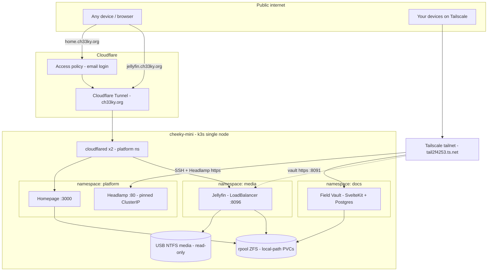

# homelab — `cheeky-mini`

Single-node **k3s** homelab running a Jellyfin media server, a personal
**document + field vault** ([doc-catalog](doc-catalog/README.md)), and a small
platform stack (dashboard, service hub, secure remote access). Built to grow:
adding agent nodes later is a one-liner, and workloads that must stay on this
box are already pinned with node labels/affinity.

> **Resilience honesty:** one node = **pod self-healing only**. k3s restarts
> crashed pods; it does **not** survive the machine dying. True HA needs 3+
> control-plane nodes for etcd quorum. This is a foundation for that, not that.

---

## Hardware / base OS

| | |
|---|---|
| Host | `cheeky-mini`, Intel i7-12650H (10c/16t), 32 GB RAM |
| GPU | Intel Alder Lake iGPU (`/dev/dri/renderD128`) — used for HW transcode |
| Boot/data disk | 1 TB NVMe, **ZFS-on-root** (ZSys); `rpool` ~816 GB free |
| Media disk | 1 TB USB Seagate, **NTFS** (ntfs-3g), mounted `/media/cheeky/seagate_hdd`, read-only to pods |
| OS | Ubuntu 24.04 desktop (also a daily debugging machine — changes kept reversible) |
| Kubernetes | k3s v1.36, `--snapshotter=native` (required on ZFS), `--disable traefik`, ServiceLB/klipper kept |

---

## Architecture



### Access model — public vs private
- **Public (Cloudflare Tunnel):** outbound-only connector, no inbound ports.
  Routing is configured in the Cloudflare Zero Trust dashboard.
  - `home.ch33ky.org` → Homepage, behind **Cloudflare Access** (email login).
  - `jellyfin.ch33ky.org` → Jellyfin, on **Jellyfin's own auth** (no Access, so
    native mobile/TV apps work).
- **Private (Tailscale host install):** the node joins the tailnet
  (`tail2f4253.ts.net`). Gives Tailscale SSH into the box and tailnet-only
  access to admin services.
  - **Headlamp** is exposed *only* on the tailnet via `tailscale serve` →
    `https://cheeky-mini.tail2f4253.ts.net`. Never public.

### Secrets
No secrets in the repo. The Cloudflare connector token lives in a k8s Secret
(`cloudflared-token`) created out-of-band. `.gitignore` blocks token/secret
files; `*.example.yaml` templates are the only committed config stand-ins.

---

## Components

| Service | Namespace | Exposure | Notes |
|---|---|---|---|
| **Jellyfin** | `media` | `jellyfin.ch33ky.org` (public) + tailnet + LAN `:8096` | linuxserver image, PUID/PGID 1000. iGPU transcode via `/dev/dri` + `supplementalGroups [992,44]` (no privileged). Media hostPath **read-only** with `HostToContainer` propagation (needed for the ntfs-3g FUSE mount). Config on a local-path PVC. Pinned to this node via `nodeAffinity: homelab/media-store=seagate`. |
| **Headlamp** | `platform` | tailnet-only (`tailscale serve`) | Cluster admin UI (successor to the archived k8s Dashboard). ClusterIP pinned `10.43.142.241` so the host-side `tailscale serve` target is stable. Login = `headlamp` ServiceAccount bearer token (cluster-admin, gated at the network layer). |
| **Homepage** | `platform` | `home.ch33ky.org` (behind Access) | Central hub. Config is a ConfigMap seeded into a writable `emptyDir` by an initContainer (the image writes into its config dir on boot). Read-only RBAC for k8s service discovery. `HOMEPAGE_ALLOWED_HOSTS` must list every hostname it's served on. |
| **cloudflared** | `platform` | — (outbound only) | 2 replicas for HA. Token from the `cloudflared-token` Secret; remotely-managed tunnel (routing in the CF dashboard). |
| **Field Vault** (doc-catalog) | `docs` | tailnet-only (`tailscale serve :8091`) | Personal document + PII vault. Postgres-only pipeline (ingest → OCR → embed → tag → PII extract), FTS + pgvector hybrid search, Gmail ingest, Presidio field extraction. SvelteKit UI, realtime via SSE. All models on-node, **no public egress**. Own docs + manifests: [doc-catalog/](doc-catalog/README.md). |

---

## Repo layout

```
jellyfin/kubernetes/       Jellyfin: namespace, config PVC, Deployment, Service, kustomization
platform/
  00-namespace.yaml        platform namespace
  headlamp/                Headlamp Deployment/Service + admin RBAC
  homepage/                Homepage Deployment/Service + config ConfigMap + discovery RBAC
cloudflare-tunnel/
  kubernetes/              cloudflared Deployment + values.example.yaml (token via Secret)
  Readme.md                tunnel setup + dashboard routing
tailscale/README.md        host install + `tailscale serve` for Headlamp
doc-catalog/               Personal document + field vault — own README, k8s in
                           kubernetes/, Python pipeline in src/, SvelteKit web/
```

Branches: **dev** = current k3s deployment · **archive/docker-legacy** =
retired pre-k3s docker-compose stacks (plex/portainer/etc.) · **main** = legacy.

---

## Deploy from scratch

Prereqs: k3s installed (`--snapshotter=native --disable traefik`), USB media
mounted via fstab, node labeled `kubectl label node cheeky-mini homelab/media-store=seagate`.

```bash
export KUBECONFIG=/etc/rancher/k3s/k3s.yaml

# Jellyfin
kubectl apply -k jellyfin/kubernetes/

# Platform: namespace, Headlamp, Homepage
kubectl apply -f platform/00-namespace.yaml
kubectl apply -f platform/headlamp/ -f platform/homepage/

# Cloudflare Tunnel (token from your tunnel; see cloudflare-tunnel/Readme.md)
kubectl -n platform create secret generic cloudflared-token --from-literal=token='<TOKEN>'
kubectl apply -f cloudflare-tunnel/kubernetes/cloudflared-deployment.yaml
```

Then: Tailscale ([tailscale/README.md](tailscale/README.md)) for private access +
SSH, and configure Cloudflare public hostnames + Access
([cloudflare-tunnel/Readme.md](cloudflare-tunnel/Readme.md)).

## Operate

Use the **[`homelab` CLI](bin/README.md)** for day-to-day ops
(`ln -sf "$(pwd)/bin/homelab" ~/.local/bin/homelab`):

```bash
homelab status          # nodes, pods, cloudflared, tailscale
homelab urls            # all service URLs
homelab token           # Headlamp login token
homelab grafana-pw      # Grafana admin password
homelab serve           # re-add tailnet proxies (Headlamp :443, Grafana :8443)
homelab join-cmd        # agent-node join one-liner
homelab debug [svc]     # diagnostics bundle
```

Raw equivalents if you prefer: `kubectl get pods -A`,
`kubectl -n platform create token headlamp`, `tailscale serve status`.

**Add an agent node** (future):
```bash
curl -sfL https://get.k3s.io | K3S_URL=https://192.168.12.21:6443 \
  K3S_TOKEN=$(sudo cat /var/lib/rancher/k3s/server/node-token) sh -
```

---

## Known follow-ups
- Jellyfin → Networking → **Known proxies** = `10.42.0.0/16` (real client IPs behind the tunnel).
- Re-home the old Grafana/Prometheus stack onto k3s if wanted.
- Dedicated `rpool/media` ZFS dataset once the USB (nearly full) gets tight.
