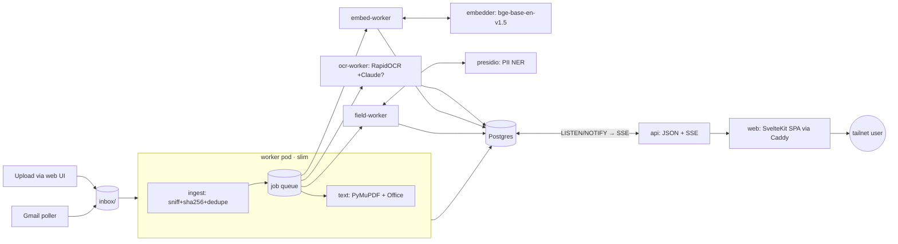

# Document Catalog

Personal document cataloging on the `cheeky-mini` k3s homelab. Ingest documents
from web/phone upload and Gmail, extract their text (born-digital, Office, or via
OCR), embed and auto-tag them against a fixed taxonomy, dedupe by content, extract
copy-ready **PII/vault fields** (passport №, SSN, USCIS receipt, card…), and make
the corpus full-text **and** semantically searchable. Single user, <5k docs —
built for quality and simplicity, not scale.

**Everything is Postgres + files on the NVMe.** No object store, no message
broker. Queue = Postgres `SELECT … FOR UPDATE SKIP LOCKED`. Blobs =
content-addressed files. Search = `tsvector` + `pgvector` in the same DB. Live UI
updates = Postgres `LISTEN/NOTIFY` → SSE (no polling).

> The catalog **is** a personal field vault: a SvelteKit UI over the corpus —
> vault shelf (copy-ready fields), library with hybrid keyword/semantic search,
> per-document detail, and a review queue. See
> [VAULT_PLAN.md](VAULT_PLAN.md) for the design, security posture, IA and mockups.

## Core principles
1. Originals are immutable; everything else is derived and regenerable.
2. Idempotent, content-hash-keyed pipeline — re-running the corpus is safe/cheap.
3. Renditions are byte-deterministic.
4. Never merge/delete duplicates destructively — link, pick canonical, hide rest.
5. Blast radius: financial/medical/PII corpus → **Tailscale-only, no public
   egress**. All models run on-node (RapidOCR, bge embeddings, Presidio PII). The
   only optional cloud call is Claude-vision OCR escalation (off by default,
   unfunded). PII extraction never leaves the box.

## Architecture

Services in namespace `docs`, all pinned to `cheeky-mini`, sharing one Postgres
and the `/srv/docs` dataset. **No image builds** — stock images + `pip --target`
into an emptyDir + hostPath-mounted source (see *Deploy*).



- **worker** — watches the inbox, runs ingest + Gmail poll + the `text` stage
  (PyMuPDF for PDFs, python-docx/pptx/openpyxl/xlrd for Office). Single writer over
  the inbox/blobs. Slim `python:3.12-slim` (no OCR libs).
- **ocr-worker** — drains the `ocr` stage only: **RapidOCR** (PP-OCR models on
  ONNXRuntime, ~550Mi/page). Own pod so OCR memory spikes are isolated. Low-conf
  pages optionally escalate to Claude vision. Image: `paddlepaddle/paddle` (CV libs).
- **embed-worker** — drains `embed`: reads text, calls the embedder, writes
  vectors + auto-tags. Lean, no dataset mount.
- **embedder** — **bge-base-en-v1.5** (768-dim) on CPU behind `POST /embed`. Own
  pod; weights cached on the dataset. (Chose bge over Qwen3-0.6B: the 512-token cap
  negated Qwen's edge; bge is ~4-5× lighter.)
- **field-worker** — drains `fields`: calls Presidio, stores candidate vault fields
  (unconfirmed). Thin (HTTP to Presidio, no NLP libs).
- **presidio** — Microsoft Presidio + spaCy on CPU behind `POST /analyze`. PII
  recognition on-node (no egress). Custom recognizers in `recognizers.py`.
- **api** — FastAPI JSON API (`/api/*`) + the SSE push channel (`/api/events`).
  Hybrid search (`/api/documents?q=` — FTS `ts_rank` fused with pgvector cosine via
  reciprocal-rank fusion), document detail/update/delete, stage re-runs, taxonomy,
  and the field-vault endpoints. The old server-rendered HTML UI has been removed —
  the SvelteKit SPA is the only UI.
- **web** — Caddy sidecar serving the **SvelteKit** static build and reverse-
  proxying `/api` + SSE to the api pod. Surfaces: **Vault** shelf (confirmed copy-
  ready fields), **Library** (browse + hybrid keyword/semantic search + upload),
  per-document **detail** (pipeline strip, stage re-runs, tag/manage, extracted
  text, provenance, fields), **Review** queue, **Status**. "The Archive" design
  system — self-hosted Newsreader + IBM Plex, SVG icons, a Graphite & Indigo
  palette, and a persisted light/dark toggle. One SSE `EventSource` keeps every
  page live (no polling).
- **postgres** — `pgvector/pgvector:pg16`: blobs, documents, pages, chunks
  (`vector(768)` + HNSW), tags, jobs, accounts, provenance, fields.

DB browsing (read-only, tables/rows/SQL) is a shared `pgweb` instance covering
both this DB and flower-delivery's — see `platform/pgweb/`, not something
deployed per-app.

## Pipeline flow

```
arrival ─► ingest ─► text ─┬─(has text)─┬─► embed ─► tagged
                           │             └─► fields ─► candidates
                           └─(no text)──► ocr ─(text)─► embed + fields
```

1. **ingest** (`ingest.py`) — a file lands in `inbox/`. Moved to `.staging`,
   MIME-sniffed (puremagic), sha256'd, written to the blob store *before* any DB
   row (crash-safe), then a `source_event` (provenance) and — for new content — a
   `document` + a `text` job. Exact dedupe is free (identical bytes → same blob).
2. **text** (`extract.py`) — PyMuPDF pulls the PDF text layer; Office formats via
   pure-python readers; `.txt` read directly. Got text → enqueue `embed` + `fields`.
   No text (scan/photo) → `needs_ocr`, enqueue `ocr`.
3. **ocr** (`ocr.py`) — rasterize pages, **RapidOCR** each; low-confidence pages
   escalate to Claude vision **if `ANTHROPIC_API_KEY` is set and funded**. Got text
   → enqueue `embed` + `fields`.
4. **embed** (`jobs.py`/`classify.py`) — embed the document via the embedder, store
   vectors in `chunk`, classify against taxonomy prototypes (relative-margin
   multi-label) + keyword/sender sub-tags → `tag`/`document_tag` (`source='auto'`).
   Status → `tagged`.
5. **fields** (`jobs._run_fields`) — call Presidio on the document text; store typed
   PII candidates in `field` (**unconfirmed**, value masked to last-4). Confirmed
   once in the UI they surface on the vault shelf.

### Job queue (`jobs.py`)
One `job` table, claimed via `FOR UPDATE SKIP LOCKED` oldest-first. Retries up to
**5 attempts with exponential backoff**; `reconcile()` requeues failed-short-of-cap
jobs *and* reclaims stale `running` jobs whose worker died. Workers are
**stage-specialized** (`WORKER_STAGES`): worker=`text`+ingest, ocr-worker=`ocr`,
embed-worker=`embed`, field-worker=`fields` — all draining the shared queue in
parallel, each isolated in its own pod.

## Semantic tagging (no LLM)

Fixed categories (`classify.py`): `finance, work, tax, housing, health, insurance,
identity-legal, education, purchases, travel` + `personal` fallback, each with
`parent:child` sub-tags. Each category description is embedded once as a
**zero-shot prototype**; a document gets every category within `CLASSIFY_MARGIN`
of its top cosine (relative, not a fixed floor — bge cosines are compressed), with
sub-tags from keyword/sender rules.

**Feedback loop:** `document_tag.source` marks `auto` vs `user`. Fixing tags in the
UI confirms them as `user`; auto re-runs never clobber user edits; ≥2 confirmed
docs upgrade a category's prototype into a fitted **centroid**, so accuracy
improves with use — no LLM.

## Field vault (PII extraction)

`recognizers.py` + the `presidio` pod extract typed fields from document text.
Presidio fuses pattern recognizers, a spaCy NER backbone, and validators (Luhn on
cards). Built-ins cover `US_SSN`, `CREDIT_CARD`, `US_PASSPORT`,
`US_DRIVER_LICENSE`; custom recognizers add the corpus-specific IDs: `SEVIS_ID`,
`USCIS_RECEIPT`, `ALIEN_NUMBER`, `I94_NUMBER`, `EIN`, `TRAVEL_PNR`, `INSURANCE_ID`,
passport MRZ. Candidates land **unconfirmed**; the user confirms once (Review),
after which they appear on the vault shelf. **Masking is a UI reveal-gate, not
encryption** — values are plaintext at rest (tailnet-only; see VAULT_PLAN.md).

## Live updates (no polling)

`migration 006/007` add statement-level `NOTIFY doccat_events` triggers on
job/document/account/field. `GET /api/events` (FastAPI SSE) LISTENs and streams the
status snapshot on any change, with a 15s heartbeat. The SvelteKit UI holds one
`EventSource` — the job queue / shelf / Review badge update instantly. The
document-detail page reacts to the same stream, so a **Re-run OCR / text / embed**
or **Save** flips its pipeline pill and refreshes tags, text and fields in place —
no manual reload.

## Storage (`rpool/docs` ZFS dataset → `/srv/docs`)
```
inbox/                 writable, watched, transient
inbox/.staging  .processed  .failed
blobs/ab/cd/<sha256>   content-addressed, immutable originals
pg/                    Postgres PGDATA
.models/               HuggingFace cache (bge embedding weights)
.paddle/               RapidOCR / HOME cache
```

## Deploy (no image build)

Stock images from docker.io; an initContainer `pip install --target`s deps into an
emptyDir and the app source is hostPath-mounted. Secrets (`doccat-postgres`,
optional `doccat-anthropic`, optional `doccat-gmail`) are created out-of-band,
never committed.

```bash
kubectl apply -f kubernetes/00-namespace.yaml
kubectl -n docs create secret generic doccat-postgres \
  --from-literal=POSTGRES_USER=doccat \
  --from-literal=POSTGRES_PASSWORD=$(openssl rand -hex 16) \
  --from-literal=POSTGRES_DB=doccat
kubectl apply -f kubernetes/10-postgres.yaml
for m in migrations/*.sql; do kubectl -n docs exec -i deploy/postgres -- psql -U doccat -d doccat < "$m"; done
kubectl apply -f kubernetes/20-worker.yaml -f kubernetes/25-ocr-worker.yaml \
  -f kubernetes/30-api.yaml \
  -f kubernetes/50-embedder.yaml -f kubernetes/60-embed-worker.yaml \
  -f kubernetes/70-web.yaml -f kubernetes/80-presidio.yaml \
  -f kubernetes/85-field-worker.yaml
# The SPA is built host-side and hostPath-mounted:
( cd web && npm install && npm run build )
kubectl -n docs get pods
```

Editing `src/doccat/*` updates pods on next restart (source is hostPath-mounted):
`kubectl -n docs rollout restart deploy/<name>`. Deps change → the initContainer
reinstalls on restart. Rebuild the SPA (`cd web && npm run build`) after editing
`web/`.

Expose tailnet-only (host, sudo — no public ingress per principle #5):
```bash
sudo tailscale serve --bg --https=8091 http://10.43.200.33:8080   # Vault / SPA (web)
```
(pgweb is deployed and exposed separately, shared with flowers — see `platform/pgweb/`.)

### Optional integrations
- **Gmail** — `doccat-gmail` holds one `token-<label>.json` (authorized_user,
  `gmail.readonly`) per account, mounted read-only. Accounts self-discover;
  ingestion pulls document + image attachments from allowed senders (size-floored),
  honouring per-account allow/deny rules. Backfill spans the whole mailbox.
- **Claude-vision OCR** — set `doccat-anthropic` (funded `ANTHROPIC_API_KEY`) to
  enable low-confidence OCR escalation. Off → RapidOCR only.

## Config (env, see `config.py`)
`DATABASE_URL`, `DOCS_ROOT`, `SCAN_INTERVAL`, `MAX_BYTES` · OCR: `OCR_DPI`,
`OCR_CONF_THRESHOLD`, `CLAUDE_VISION_MODEL` · Gmail: `GMAIL_POLL_INTERVAL`,
`GMAIL_INITIAL_QUERY`, `GMAIL_ATTACH_MIME/EXT`, `GMAIL_IMAGE_*` · Embedding:
`EMBEDDER_URL`, `EMBED_MODEL`, `EMBED_DIM`, `CLASSIFY_THRESHOLD`, `CLASSIFY_MARGIN`
· Fields: `PRESIDIO_URL`, `FIELDS_SCORE_THRESHOLD` · Workers: `WORKER_STAGES`,
`WORKER_INGEST`, `JOB_STALE_SECONDS`.

## Schema (migrations/)
`blob` · `source_event` (provenance) · `document` · `page` (text + engine +
`tsvector`) · `chunk` (`vector(768)` + HNSW) · `extraction` (classification audit) ·
`tag`/`document_tag` (`source` auto|user) · `job` (queue) · `account`/`sender_rule`
(Gmail) · `field` (typed PII/vault candidates).
```
001_init  002_fts  003_tags  004_embeddings  005_gte_embeddings(→768)
006_notify(SSE)  007_fields(vault)
```
