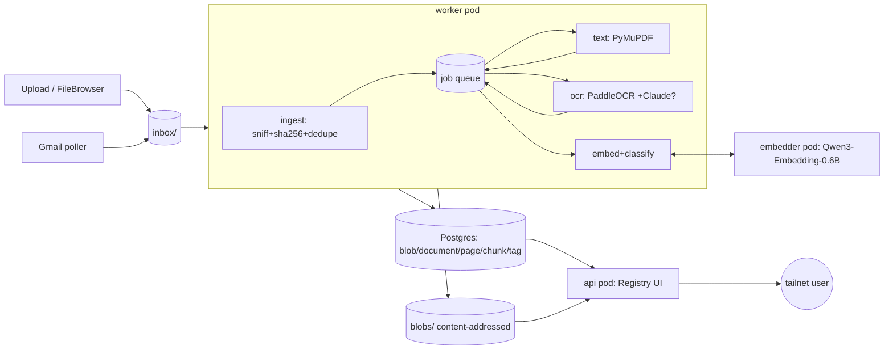

# Document Catalog

Personal document cataloging on the `cheeky-mini` k3s homelab. Ingest documents
from web/phone upload and Gmail, extract their text (born-digital or via OCR),
embed and auto-tag them against a fixed taxonomy, dedupe by content, and make the
corpus full-text **and** semantically searchable. Single user, <5k docs — built
for quality and simplicity, not scale.

**Everything is Postgres + files on the NVMe.** No object store, no message
broker. Queue = Postgres `SELECT … FOR UPDATE SKIP LOCKED`. Blobs =
content-addressed files. Search = `tsvector` + `pgvector` in the same DB.

## Core principles
1. Originals are immutable; everything else is derived and regenerable.
2. Idempotent, content-hash-keyed pipeline — re-running the corpus is safe/cheap.
3. Renditions are byte-deterministic.
4. Never merge/delete duplicates destructively — link, pick canonical, hide rest.
5. Blast radius: financial/medical corpus → **Tailscale-only, no public egress**.
   The one exception is optional Claude-vision OCR (cloud) — an accepted tradeoff,
   off by default. Local embeddings + PaddleOCR keep the default path fully local.

## Architecture

Five services in namespace `docs`, all pinned to `cheeky-mini`, sharing one
Postgres and the `/srv/docs` dataset. No image builds — stock images +
`pip --target` into an emptyDir + hostPath-mounted source (see *Deploy*).



- **worker** — watches the inbox, runs ingest + the `text`/`ocr` stages. Single
  writer over the inbox/blobs. Image: `paddlepaddle/paddle` (ships OCR libs).
- **embed-worker** — a lean second worker that drains only the `embed` stage, so
  a slow/large document never blocks text/OCR (both consume the same queue in
  parallel). No Paddle, no dataset mount — it just reads text, calls the embedder,
  writes vectors/tags.
- **embedder** — Qwen3-Embedding-0.6B on CPU behind `POST /embed`. Own pod so its
  memory doesn't crowd the workers. Weights cached on the dataset.
- **api** — FastAPI "Registry" UI: browse, full-text + semantic search, document
  detail (provenance, extracted text, tag picker, delete, re-run), `/status`
  (accounts, sender rules, job queue), and upload.
- **postgres** — `pgvector/pgvector:pg16`. Blobs, documents, pages, chunks
  (`vector(1024)`), tags, jobs, accounts, provenance.

## Pipeline flow

```
arrival ─► ingest ─► text ─┬─(has text)─► embed ─► tagged
                           └─(no text)──► ocr ─(text)─► embed ─► tagged
```

1. **ingest** (`ingest.py`) — a file lands in `inbox/` (upload or Gmail). Moved to
   `.staging`, MIME-sniffed (puremagic), sha256'd, written to the blob store
   *before* any DB row (crash-safe), then: always a `source_event` (provenance),
   and — only for genuinely new content — a `document` + a `text` job. Exact
   dedupe is free: identical bytes → same blob → no new document, just added
   provenance. Original archived to `.processed/`; failures quarantined to
   `.failed/` with a `.error.json` sidecar.
2. **text** (`extract.py`) — PyMuPDF pulls the embedded text layer (or reads
   `.txt`). Got text → enqueue `embed`. No text (scan/photo/image) → `needs_ocr`,
   enqueue `ocr`.
3. **ocr** (`ocr.py`) — rasterize pages, PaddleOCR (CPU) each; pages below a
   confidence floor escalate to Claude vision **if `ANTHROPIC_API_KEY` is set and
   funded** (else Paddle text is kept). Got text → enqueue `embed`.
4. **embed** (`classify.py`) — embed the whole document (+ each page as a chunk)
   via the embedder, store vectors in `chunk`, then classify: cosine of the doc
   vector against the taxonomy prototypes (multi-label threshold) + keyword/sender
   sub-tag rules → write `tag`/`document_tag` (as `source='auto'`) and an
   `extraction` audit row. Status → `tagged`.

### Job queue (`jobs.py`)
One `job` table, claimed via `FOR UPDATE SKIP LOCKED` oldest-first. Retries up to
**5 attempts with exponential backoff** (`2**attempts` minutes); `reconcile()`
requeues jobs that failed short of the cap. Workers are **stage-specialized**
(`WORKER_STAGES`): the main worker takes `text,ocr` + ingest, the embed-worker
takes `embed` — they drain the shared queue in parallel, so slow embedding is
isolated from the fast path.

## Semantic tagging (no LLM)

Categories are fixed (`classify.py`): `finance, work, tax, housing, health,
insurance, identity-legal, education, purchases, travel` + `personal` fallback,
each with `parent:child` sub-tags. Each category has a description that is
embedded once to form a **zero-shot prototype**; a document is tagged with every
category whose cosine clears `CLASSIFY_THRESHOLD` (multi-label), with sub-tags
decided by keyword/sender rules.

**Feedback loop:** `document_tag.source` marks `auto` vs `user`. Fixing tags in
the UI (a typo-proof chip picker) confirms them as `user` — labelled data — and
auto re-runs never clobber user edits. Those confirmed tags upgrade the zero-shot
prototypes into fitted **centroids**, so accuracy improves with use, no LLM and
no manual model work. (Zero-shot alone is rough; the correction loop is the point.)

## Storage (`rpool/docs` ZFS dataset → `/srv/docs`)
```
inbox/                 writable, watched, transient   (FileBrowser + upload land here)
inbox/.staging  .processed  .failed
blobs/ab/cd/<sha256>   content-addressed, immutable originals
pg/                    Postgres PGDATA
.models/               HuggingFace cache (Qwen embedding weights)
.paddle/               PaddleOCR model cache
.filebrowser/          FileBrowser DB
```

## Deploy (no image build)

Pods use stock images from docker.io; an initContainer `pip install --target`s
deps into an emptyDir and the app source is hostPath-mounted from this repo. No
registry, no Dockerfile. Secrets (`doccat-postgres`, optional `doccat-anthropic`,
optional `doccat-gmail`) are created out-of-band and never committed.

```bash
kubectl apply -f kubernetes/00-namespace.yaml
kubectl -n docs create secret generic doccat-postgres \
  --from-literal=POSTGRES_USER=doccat \
  --from-literal=POSTGRES_PASSWORD=$(openssl rand -hex 16) \
  --from-literal=POSTGRES_DB=doccat
kubectl apply -f kubernetes/10-postgres.yaml
kubectl -n docs exec -i deploy/postgres -- psql -U doccat -d doccat < migrations/001_init.sql   # + 002..004
kubectl apply -f kubernetes/20-worker.yaml -f kubernetes/30-api.yaml \
               -f kubernetes/40-filebrowser.yaml -f kubernetes/50-embedder.yaml \
               -f kubernetes/60-embed-worker.yaml
kubectl -n docs get pods
```

Editing `src/doccat/*` updates the pods on their next restart (source is
hostPath-mounted): `kubectl -n docs rollout restart deploy/worker deploy/api`.
Deps change → the initContainer reinstalls on restart automatically.

Expose tailnet-only (host, sudo — no public ingress per principle #5):
```bash
sudo tailscale serve --bg --https=8090 http://10.43.200.31:8080   # FileBrowser
sudo tailscale serve --bg --https=8091 http://10.43.200.30:8000   # Registry UI
```

### Optional integrations
- **Gmail** — `doccat-gmail` secret holds one `token-<label>.json`
  (authorized_user, `gmail.readonly`) per account, mounted read-only. Accounts
  self-discover; ingestion pulls **document attachments only** (PDF/Office —
  images skipped) and honours per-account allow/deny sender rules editable on
  `/status`.
- **Claude-vision OCR** — set `doccat-anthropic` (`ANTHROPIC_API_KEY`, a funded
  Console key) to enable low-confidence OCR escalation. Off → PaddleOCR only.

## Config (env, see `config.py`)
`DATABASE_URL`, `DOCS_ROOT`, `SCAN_INTERVAL`, `QUIESCENCE_AGE`, `MAX_BYTES` ·
OCR: `OCR_DPI`, `OCR_CONF_THRESHOLD`, `CLAUDE_VISION_MODEL` · Gmail:
`GMAIL_POLL_INTERVAL`, `GMAIL_INITIAL_QUERY`, `GMAIL_ATTACH_MIME/EXT` · Embedding:
`EMBEDDER_URL`, `EMBED_MODEL`, `EMBED_DIM`, `EMBED_MAX_CHARS`, `CLASSIFY_THRESHOLD`.

## Schema (migrations/)
`blob` (immutable bytes) · `source_event` (append-only provenance, unique
`(source,source_ref)`) · `document` (canonical/dup) · `page` (text + engine +
`tsvector`) · `chunk` (`vector(1024)` + HNSW) · `extraction` (versioned
classification audit) · `tag`/`document_tag` (`source` auto|user) · `job` (queue)
· `account`/`sender_rule` (Gmail).
```
001_init  002_fts  003_tags  004_embeddings
```
