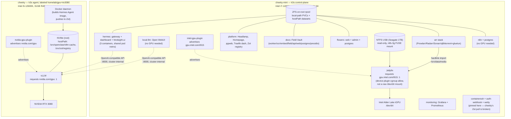
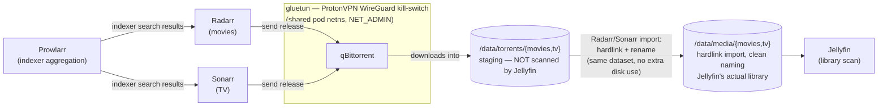

# Architecture

Detailed companion to the [top-level README](../README.md)'s "at a glance"
diagram. Three diagrams, each scoped to one concern:

1. **Access layer** — every way in, public through cluster-internal-only.
2. **Node & hardware placement** — which of the two boxes runs what, the two
   GPU device plugins, and the three storage patterns in play.
3. **arr-stack data flow** — the one genuinely non-obvious multi-hop pipeline
   in the repo (download → import → library).

All ports, IPs, and image names below are read straight from the manifests
in this repo (not aspirational) — check the referenced `kubernetes/` dir if
one of these ever looks wrong, manifests are the source of truth.

---

## 1. Access layer

Three independent lanes converge on ClusterIP services inside k3s. Nothing
in the tailnet lane or cluster-internal lane is ever reachable from the
public internet — there's no ingress controller routing traffic between
lanes, only the apps that happen to sit in more than one lane (e.g. Jellyfin
is both public *and* tailnet *and* LAN, on three separate paths that just
happen to hit the same pod).

```mermaid
flowchart TB
    subgraph pub["Public internet"]
        user["Any device / browser"]
    end
    subgraph priv["Your devices"]
        you["Tailscale client"]
    end

    subgraph cf["Cloudflare (remote-managed routing)"]
        access["Access policy\n(email login)"]
        tunnel["Tunnel — ch33ky.org"]
    end

    ts["Tailscale tailnet\ntail2f4253.ts.net"]

    subgraph k3s["k3s cluster — pinned ClusterIPs, 10.43.200.1x/5x block"]
        direction TB
        cfd["cloudflared ×2\n(platform, outbound-only)"]

        subgraph publicsvc["Reached via Cloudflare Tunnel"]
            home["Homepage :3000\n(platform)"]
            jelly["Jellyfin :8096\n(media, own auth)"]
            flow["Flowers web\n(flowers, no auth)"]
        end

        subgraph tailsvc["Reached via tailscale serve (tailnet-only)"]
            head["Headlamp :443\n(platform)"]
            graf["Grafana :8443\n(monitoring)"]
            pgweb["pgweb :8081\n(platform → docs + flowers DBs)"]
            flowadmin["Flowers Admin :8092\n(flowers)"]
            vault["Field Vault :8091\n(docs)"]
            traefikdash["Traefik dashboard :8444\n(kube-system)"]
            owui["Open WebUI :8094\n(local-llm)"]
            zotreg["Zot registry :8095\n(platform)"]
            hermesdash["Hermes dashboard :8096\n(hermes)"]
            hindsight["Hindsight UI :8097\n(hermes)"]
            prowlarr["Prowlarr :9696"]
            radarr["Radarr :7878"]
            sonarr["Sonarr :8989"]
            qbit["qBittorrent :8080\n(media, via gluetun)"]
            cssh["ContainerSSH :2222\n(raw TCP, containerssh)"]
            wetty["Wetty :8098\n(containerssh)"]
            n8n["n8n :8099\n(n8n)"]
        end

        subgraph internalsvc["Cluster-internal only — no tailnet or public path"]
            vllm["vLLM :8000\n(local-llm, on cheeky/GPU)"]
            pgdocs[("Postgres\ndocs")]
            pgflowers[("Postgres\nflowers")]
            pgn8n[("Postgres\nn8n")]
            gluetun["gluetun\n(ProtonVPN netns for qBittorrent)"]
            guestpods["containerssh-guests\n(one throwaway pod/session)"]
        end
    end

    user -->|"home.ch33ky.org"| access --> tunnel
    user -->|"jellyfin.ch33ky.org"| tunnel
    user -->|"flowers.ch33ky.org"| tunnel
    tunnel --> cfd
    cfd --> home
    cfd --> jelly
    cfd --> flow

    you --> ts
    ts -->|"tailscale serve --https/--tcp,\none pinned port per service"| tailsvc

    owui --> vllm
    hermesdash --> vllm
    pgweb --> pgdocs
    pgweb --> pgflowers
    pgweb --> pgn8n
    n8n --> pgn8n
    qbit --> gluetun
    prowlarr --> radarr
    prowlarr --> sonarr
    radarr --> qbit
    sonarr --> qbit
    cssh --> guestpods
    wetty --> cssh
```

- **Public (Cloudflare Tunnel):** `cloudflared`, 2 replicas, outbound-only —
  no inbound port ever opens on the host for this lane. Hostname routing is
  configured in the Cloudflare Zero Trust dashboard, not in this repo.
  `home` sits behind Cloudflare Access (email login); `jellyfin` deliberately
  skips Access so native mobile/TV apps can authenticate directly; `flowers`
  has no auth at all — public/link-based by design, nothing sensitive stored.
- **Private (Tailscale):** the node joins the tailnet once
  (`tailscale up --ssh`), then every admin service gets a **pinned
  ClusterIP** + a `sudo tailscale serve --bg --https=<port> http://<ClusterIP>:<port>`
  binding on the host — pinning the ClusterIP means the tailnet mapping
  survives pod/Service redeploys. `homelab serve` re-establishes all of
  these after a reboot; `homelab urls` prints the resulting list. Two
  `tailscale serve` modes are in use: `--https` for web apps, `--tcp` for
  ContainerSSH's raw SSH port.
- **Cluster-internal only:** vLLM is never tailnet or public exposed — Open
  WebUI and Hermes's gateway/dashboard are the only things that talk to it
  directly, over its ClusterIP. Each Postgres instance is reached only by
  their owning app plus the shared `pgweb` browser. `containerssh-guests`
  pods have no Service at all — access is exclusively through the
  ContainerSSH/Wetty front doors, which proxy a session in and delete the
  pod on disconnect.
- **Traefik** is k3s-bundled and left enabled, but **not used as an ingress
  for any app today** — no IngressRoutes exist. Its dashboard/API is reached
  the same way as every other admin UI (pinned Service + `tailscale serve`),
  deliberately kept `ClusterIP` rather than the chart's default
  `LoadBalancer` — klipper's non-interface-scoped iptables DNAT on `:443`
  was hijacking Tailscale's own `:443` binding for Headlamp.

---

## 2. Node & hardware placement

Two nodes, bare metal, no virtualization. Placement is driven by three
things: which node owns the GPU a workload needs, which node owns the
physical disk a workload's data lives on, and one open issue (`cheeky`'s
containerd doesn't currently pull from the Zot registry mirror, so anything
built and pushed to Zot stays pinned to `cheeky-mini` until that's fixed).

**Storage patterns — three, each for a different durability need:**

| Pattern | Used by | Why |
|---|---|---|
| **`local-path` PVC** (k3s bundled provisioner, node-local dynamic) | Jellyfin config, qBittorrent config, Prometheus (20Gi/15d), Grafana (5Gi) | Fine for state that's regenerable or non-critical if lost; simplest option, no manual `mkdir`. |
| **hostPath on a dedicated ZFS dataset** (`rpool/...`) | `/srv/docs` (Field Vault), `/srv/hermes/data`, `/srv/zot/registry`, `/srv/data` (arr + Jellyfin library), `/srv/n8n/{data,pg}`, `/srv/openclaw/vllm-cache` (HF weights, on `cheeky`) | Stable, known path for anything worth backing up or too specific for a generic PVC (e.g. Postgres PGDATA, HF model cache). |
| **hostPath on the read-only NTFS USB** | Jellyfin's `Movies`/`TvShows` source library | Physical media, not cluster-managed storage — mounted `HostToContainer` so the ntfs-3g FUSE mount is visible inside the pod, read-only so nothing in the cluster can touch the source files. |

**GPU device plugins — both work the same way:** advertise a schedulable
resource (`gpu.intel.com/i915` / `nvidia.com/gpu`), and the consuming pod
requests it under `resources.limits` instead of mounting a raw device path.
Jellyfin does **not** mount `/dev/dri` directly — a bare hostPath mount
can't grant the device-cgroup `open()` permission a non-privileged pod
needs; the Intel plugin handles that. Jellyfin's pod still needs
`supplementalGroups: [992, 44]` (render, video) for the *file* permission
check underneath the cgroup allow.

---

## 3. arr-stack data flow

The only multi-hop pipeline in the repo where a file physically moves
through several apps before Jellyfin ever sees it. All four apps sit in the
`media` namespace on `cheeky-mini`; only qBittorrent's torrent traffic rides
the VPN — indexer/API calls from the other three don't need it.

Keeping `staging` and `library` as **separate trees on the same ZFS
dataset** is the whole point: if qBittorrent saved straight into
`/data/media`, Jellyfin would show two entries per file — the
raw torrent-named one and Radarr/Sonarr's renamed import. Hit this for real
once; this split is why it doesn't recur. See
[arr/kubernetes/README.md](../arr/kubernetes/README.md) for the wire-up
steps (indexer config, download-client config, the ProtonVPN NAT-PMP
forwarded-port gotcha).
